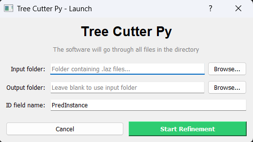
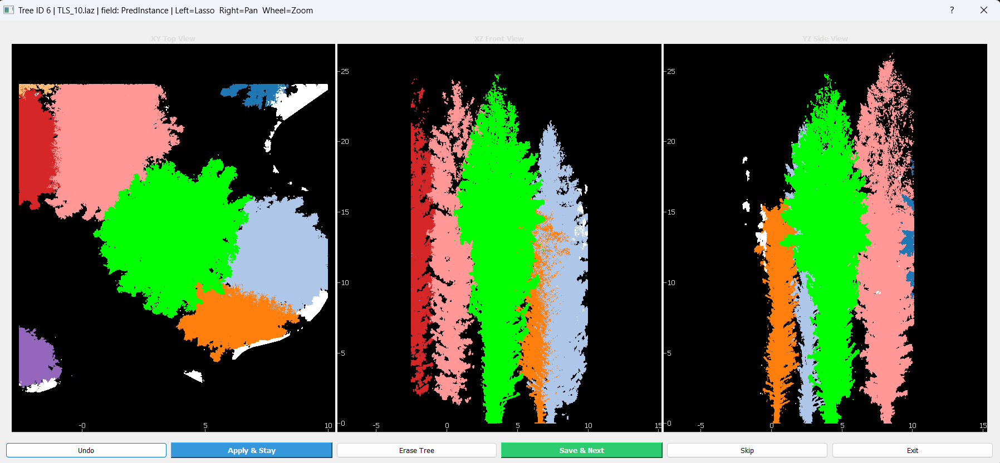
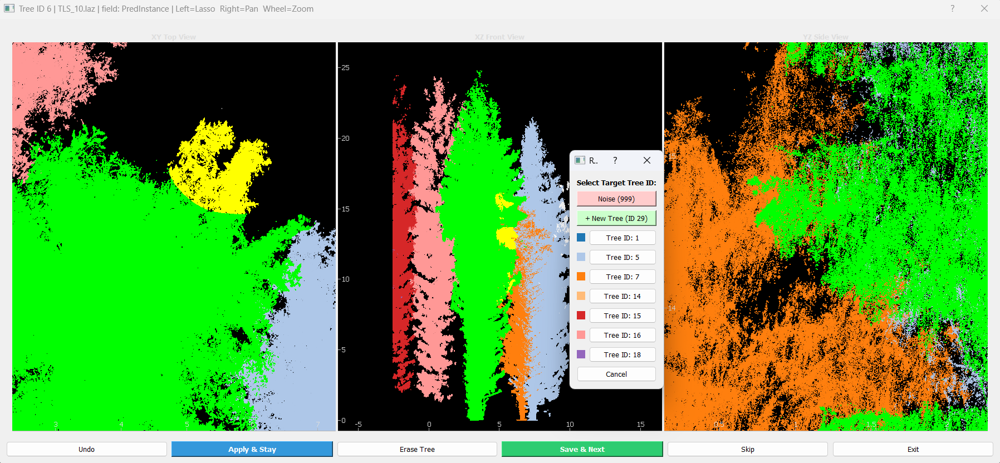
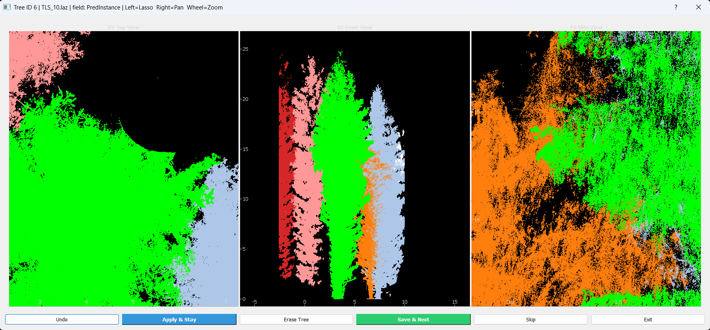
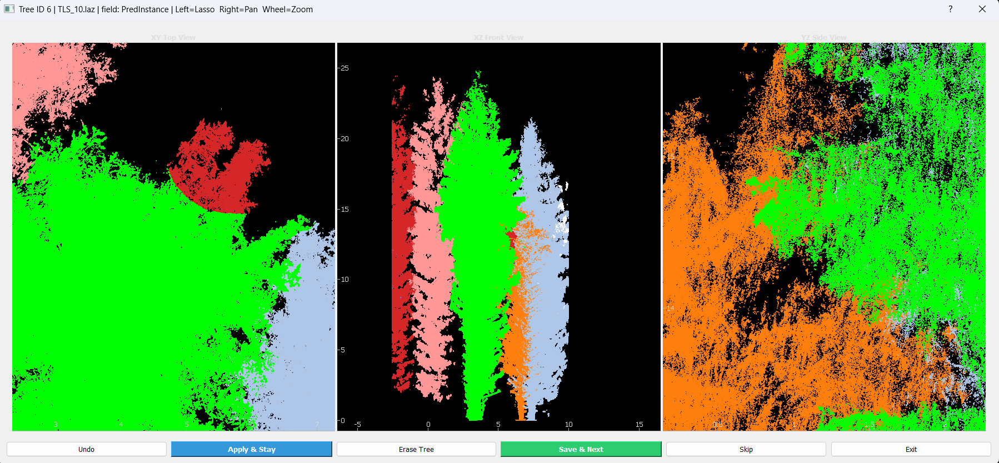

# TreeCutterPy

**TreeCutterPy** is a Python package for refining automatically segmented tree
point clouds from TLS and ALS data. It provides an interactive viewer with
lasso-based reassignment for cleaning up imperfect segmentations.

---

## Installation

(Optional but recommended) create a virtual environment first:

\`\`\`bash
python -m venv .venv
.venv\Scripts\activate
\`\`\`

Then install the package:

\`\`\`bash
pip install git+https://github.com/SirLotus1994/Tree_cutter_py.git
\`\`\`

Dependencies (numpy, laspy, matplotlib, PyQt5, pyqtgraph, PyOpenGL) are
installed automatically.

## Quick start

Run from the terminal:

\`\`\`bash
tree-cutter
\`\`\`

…or from Python:

\`\`\`python
from tree_cutter import main
main()
\`\`\`

## Tutorial

### 1. Launch and pick directories

When you start TreeCutterPy, a launch dialog appears asking for an **input
folder** (containing the `.laz` files with segmented trees) and an **output
folder** (where cleaned files will be saved).

The "ID field" box is the name of the per-point attribute that identifies
each tree (for example `PredInstance` if your trees were segmented with
SegmentAnyTree). Change it to whatever your segmentation tool uses.

### 2. The three-view interface

Once a file is loaded, three panes show the same point cloud from different
angles: top-down (XY), front (XZ), and side (YZ). Each tree's points are
coloured by its ID.

Mouse controls:
- **Left-drag**: lasso-select points
- **Right-drag**: pan
- **Scroll wheel**: zoom (zooms toward cursor position)

### 3. Lasso-selecting points

Hold left mouse button and drag around a region of points. A yellow polyline
shows your in-progress selection.

Release the button to close the lasso. All points inside the polygon are
selected.

### 4. Reassign selected points to a different tree ID

A window appears asking for the new ID to assign to the selected points.
Type the existing tree ID you want to merge them into, or a new number for
a completely new tree.

You can stack multiple reassignments before applying them — use the **Undo**
button to step back, 

or **Apply and Stay** to commit all pending reassignments to
the file. So what it was just removed will come back with the chosen color.

### 5. Save and move on

When you're happy with the tree, click **Save and Next** to write the cleaned file
to your output folder. The program automatically advances to the next
`.laz` file in the input folder.

## Tips

- The tool is designed for files containing **multiple trees** (e.g. a plot).
  For files with one tree per file, the lack of neighbour context makes
  refinement difficult.
- ID conflicts are detected: if you try to reassign points to an ID that
  doesn't exist yet, the program will ask whether to create it.
- The `PYQTGRAPH_QT_LIB` environment variable is set to PyQt5 automatically;
  if you've manually installed PyQt6 it should not interfere.

## Final words

- If you have any trouble with the software, please let me know in the issues, 
I will be happy to improve it further.

## How to cite

If you use this software in academic work, please cite:

> Papucci, E., & Yrttimaa, T. (2026). *TreeCutterPy: interactive point-cloud
> tree cutter and reclassifier* (v1.6.0). Zenodo.
> https://doi.org/10.5281/zenodo.20395899

A formal journal paper describing the tool is in preparation; citation will
be updated once published.

## License

MIT — see [LICENSE](LICENSE).
